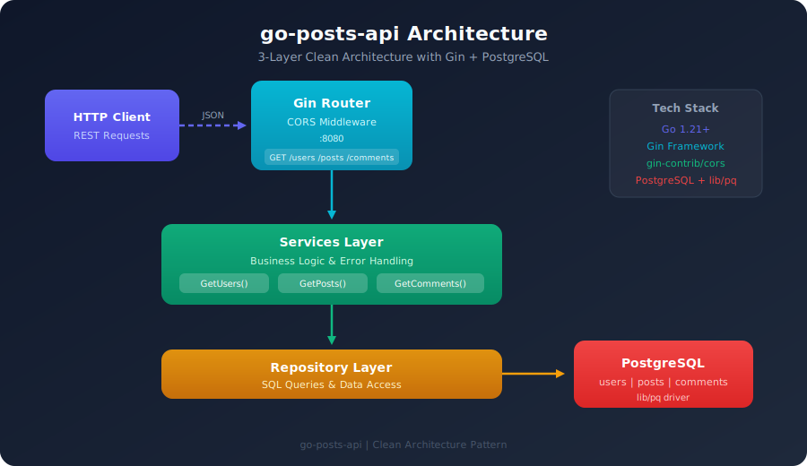
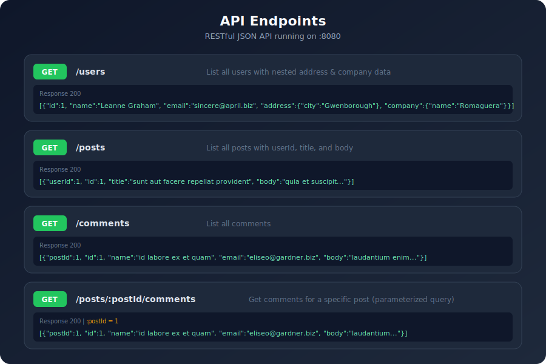
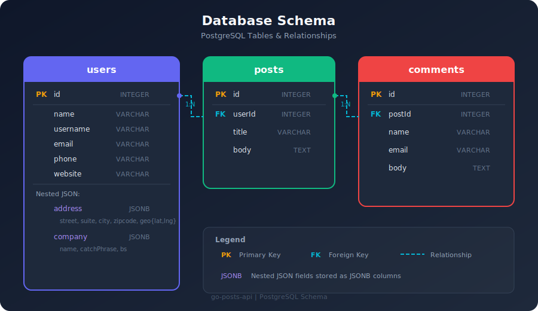
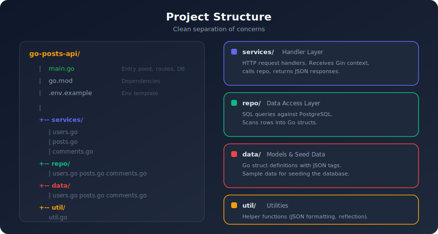

<h1 align="center">go-posts-api</h1>

<p align="center">
  <strong>A clean, production-style REST API built with Go, Gin, and PostgreSQL</strong>
</p>

<p align="center">
  
  
  
  
</p>

---

## Architecture

A 3-layer clean architecture separating HTTP handlers, data access, and models.

<p align="center">
  
</p>

---

## API Endpoints

Four RESTful endpoints serving JSON data from PostgreSQL.

<p align="center">
  
</p>

### Quick Reference

| Method | Endpoint | Description |
|--------|----------|-------------|
| `GET` | `/users` | List all users with nested address & company |
| `GET` | `/posts` | List all posts |
| `GET` | `/comments` | List all comments |
| `GET` | `/posts/:postId/comments` | Get comments for a specific post |

### Example Requests

```bash
# Get all users
curl http://localhost:8080/users

# Get all posts
curl http://localhost:8080/posts

# Get comments for post 1
curl http://localhost:8080/posts/1/comments
```

---

## Database Schema

<p align="center">
  
</p>

### Tables

**`users`** — id, name, username, email, phone, website, address (JSONB), company (JSONB)

**`posts`** — id, userId (FK → users), title, body

**`comments`** — id, postId (FK → posts), name, email, body

---

## Project Structure

<p align="center">
  
</p>

```
go-posts-api/
├── main.go              # Entry point — Gin router, CORS, DB connection, routes
├── services/            # HTTP handlers — receive context, call repo, return JSON
│   ├── users.go
│   ├── posts.go
│   └── comments.go
├── repo/                # Data access — SQL queries, row scanning
│   ├── users.go
│   ├── posts.go
│   └── comments.go
├── data/                # Models & seed data — struct definitions, sample data
│   ├── users.go
│   ├── posts.go
│   └── comments.go
├── util/                # Utilities
│   └── util.go
├── docs/                # Documentation & diagrams
├── .env.example         # Environment variable template
├── go.mod
└── go.sum
```

---

## Getting Started

### Prerequisites

- **Go** 1.21 or higher
- **PostgreSQL** running and accessible

### 1. Clone the repository

```bash
git clone https://github.com/your-username/go-posts-api.git
cd go-posts-api
```

### 2. Configure environment

```bash
cp .env.example .env
```

Edit `.env` with your database credentials:

```env
DB_HOST=localhost
DB_PORT=5432
DB_USER=postgres
DB_PASSWORD=your_password
DB_NAME=postgres
DB_SSLMODE=disable
```

### 3. Set up the database

Create the required tables in PostgreSQL:

```sql
CREATE TABLE users (
    id SERIAL PRIMARY KEY,
    name VARCHAR(255),
    username VARCHAR(255),
    email VARCHAR(255),
    phone VARCHAR(100),
    website VARCHAR(255),
    address JSONB,
    company JSONB
);

CREATE TABLE posts (
    id SERIAL PRIMARY KEY,
    userId INTEGER REFERENCES users(id),
    title VARCHAR(500),
    body TEXT
);

CREATE TABLE comments (
    id SERIAL PRIMARY KEY,
    postId INTEGER REFERENCES posts(id),
    name VARCHAR(500),
    email VARCHAR(255),
    body TEXT
);
```

### 4. Run the server

```bash
go run main.go
```

Server starts on **`:8080`** by default.

---

## Environment Variables

| Variable | Default | Description |
|----------|---------|-------------|
| `DB_HOST` | `localhost` | PostgreSQL host |
| `DB_PORT` | `5432` | PostgreSQL port |
| `DB_USER` | `postgres` | Database user |
| `DB_PASSWORD` | _(empty)_ | Database password |
| `DB_NAME` | `postgres` | Database name |
| `DB_SSLMODE` | `disable` | SSL mode (`disable` / `require`) |

---

## Tech Stack

| Technology | Purpose |
|------------|---------|
| [Go](https://go.dev/) | Language |
| [Gin](https://github.com/gin-gonic/gin) | HTTP web framework |
| [gin-contrib/cors](https://github.com/gin-contrib/cors) | CORS middleware |
| [lib/pq](https://github.com/lib/pq) | PostgreSQL driver |
| [PostgreSQL](https://www.postgresql.org/) | Relational database |

---

## License

This project is open source and available under the [MIT License](LICENSE).
